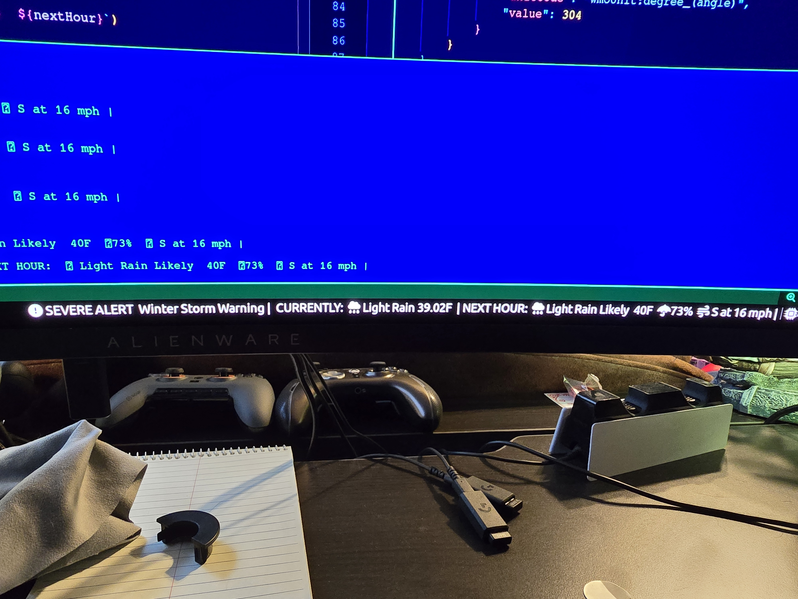
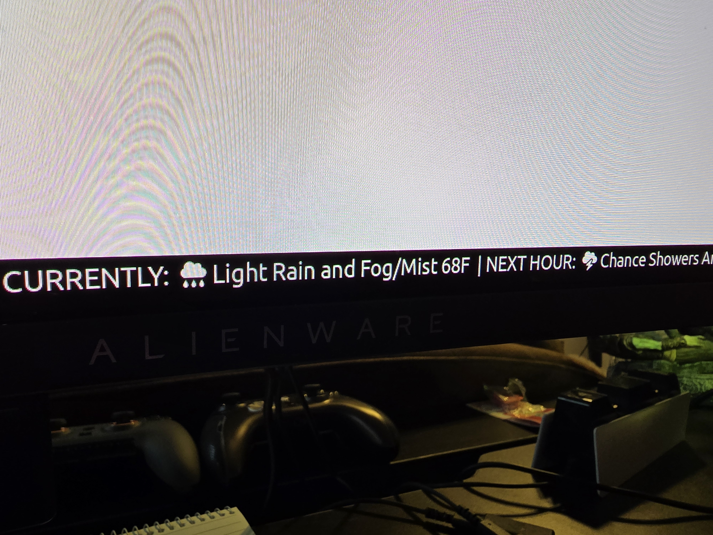

# i3blocks Weather

Example of Severe Alert




### Prerequisites
Install fontawesome \
```sudo pacman -S ttf-font-awesome```

Install node \
```sudo pacman -S nodejs```

Install npm \
```sudo pacman -S npm```


### To install
1. Clone this repository
2. CD into the cloned repository
3. Install dependencies \
```npm install```
4. Update the ```weather.js``` file with your lat, long, zone, and observation station. You can get your lat and long from [NOAA]('https://www.noaa.gov') by entering your zipcode or location.  Then use those lats and longs in this url to get the other stuff `https://api.weather.gov/points/<YOUR LAT>, <YOUR LONG>`.  You can find the zone at the end of the ```forecastZone``` property and the observation station you want to use can be obtained from the link in the ```observationStations``` property.
```
    // MAKE THIS YOUR OBSERVATION STATION CODE
    const observationStation = 'KILM'
    // MAKE THIS YOUR LAT
    const lat = '34.13'
    // MAKE THIS YOUR LONG
    const long = '-77.9'
    // MAKE THIS YOUR NWS ZONE
    const zone = 'NCZ108'
```

5. Make a script file for i3blocks and make sure to give it permissions
```
touch <PATH_TO_YOUR_I3_SCRIPTS>/weather-i3blocks
```
```
sudo chmod +x <PATH_TO_YOUR_I3_SCRIPTS>/weather-i3blocks 
```
6. Add the following to the newly created script file: <strong>NOTE THIS WONT WORK IF YOU DID NOT INSTALL NODE</strong>
```
#!/bin/sh

NODE_PATH=/usr/local/lib/node_modules node <PATH TO WHERE YOU CLONED THIS REPO>/weather.js

```
7. Update your i3blocks config to reference the new script
```
[weather-i3blocks]
command=<PATH_TO_YOUR_I3_SCRIPTS>/weather-i3blocks
interval=100
```